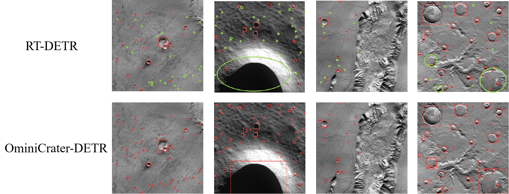

# OmniCrater-DETR: A Transformer-Based Framework for Cross-Scale Crater Detection on Planetary Surfaces

 OmniCrater-DETR, a lightweight Transformer-based framework designed for robust crater detection across scales and terrains.

<!-- PROJECT SHIELDS -->

[![Contributors][contributors-shield]][contributors-url]
[![Forks][forks-shield]][forks-url]
[![Stargazers][stars-shield]][stars-url]
[![Issues][issues-shield]][issues-url]
[![MIT License][license-shield]][license-url]


<!-- links -->
[your-project-path]:Chuan-lz/OminiCrater-DETR
[contributors-shield]: https://img.shields.io/github/contributors/Chuan-lz/OminiCrater-DETR.svg?style=flat-square
[contributors-url]: https://github.com/Chuan-lz/OminiCrater-DETR/graphs/contributors
[forks-shield]: https://img.shields.io/github/forks/Chuan-lz/OminiCrater-DETR.svg?style=flat-square
[forks-url]: https://github.com/Chuan-lz/OminiCrater-DETR/network/members
[stars-shield]: https://img.shields.io/github/stars/Chuan-lz/OminiCrater-DETR.svg?style=flat-square
[stars-url]: https://github.com/Chuan-lz/OminiCrater-DETR/stargazers
[issues-shield]: https://img.shields.io/github/issues/Chuan-lz/OminiCrater-DETR.svg?style=flat-square
[issues-url]: https://img.shields.io/github/issues/Chuan-lz/OminiCrater-DETR.svg
[license-shield]: https://img.shields.io/github/license/Chuan-lz/OminiCrater-DETR.svg?style=flat-square
[license-url]: https://github.com/Chuan-lz/OminiCrater-DETR/blob/master/LICENSE.txt


<p align="center">
  <a href="https://github.com/Chuan-lz/OminiCrater-DETR/">
    
  </a>


  <p align="center">
   Comparison of our method with the baseline RT-DETR detection results.Red circles indicate correct detections, green circles indicate missed detections.
    <br />
    <a href="https://github.com/Chuan-lz/OminiCrater-DETR"><strong>Explore the project's documentation »</strong></a>
    <br />


---


🧪 Experimental Environment:
Python: 3.9

PyTorch: 2.0.0 + CUDA 12.2

Torchvision: 0.14.1 + CUDA 12.2

timm: 0.9.8

mmcv: 2.1.0

mmengine: 0.9.0


%%%% This project is developed based on ultralytics.
1. **Uninstall the `ultralytics` library** completely from your environment by running:  
   ```bash
   pip uninstall ultralytics
   ```  
 

2. **Run the uninstall command again** to confirm it's fully removed. If you see:  
   ```
   WARNING: Skipping ultralytics as it is not installed.
   ```  
   then the library has been completely uninstalled.

3. **Optional**: If you want to use the official CLI provided by the `ultralytics` repo, install the library in "develop" mode by running:  
   ```bash
   python setup.py develop
   ```  
   > ✅ *This step is optional. You can skip it if you don't plan to use the official CLI.*

4. **Install the required packages** using the following command:  
   ```bash
   pip install timm==0.9.8 thop efficientnet_pytorch==0.7.1 einops grad-cam==1.4.8 dill==0.3.6 albumentations==1.3.1 pytorch_wavelets==1.3.0 tidecv PyWavelets -i https://pypi.tuna.tsinghua.edu.cn/simple
   ```

   **If you're using DyHead**, these additional packages are **mandatory**:  
   ```bash
   pip install -U openmim
   mim install mmengine
   mim install "mmcv>=2.0.0"
   ```

   > ⚠️ *If these packages aren't installed properly, DyHead will not function correctly!*

5. During runtime, if you encounter any missing package errors, please install them manually as needed.


### Dataset
How to obtain PLANET CRATER DETECTION DATASET (PCDD):https://github.com/Chuan-lz/PCDD.git


#### How to participate in open source projects

Contributions make the open source community a great place to learn, inspire, and create. Any contribution you make is **very much appreciated**.


1. Fork the Project
2. Create your Feature Branch (`git checkout -b feature/AmazingFeature`)
3. Commit your Changes (`git commit -m 'Add some AmazingFeature'`)
4. Push to the Branch (`git push origin feature/AmazingFeature`)
5. Open a Pull Request


